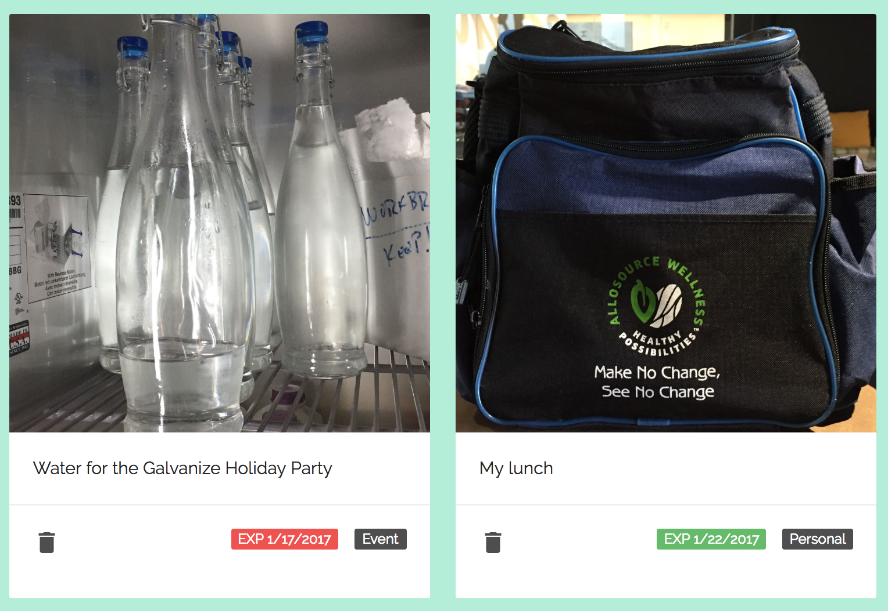

# Fridge Face

 Fridge Face is a friendly inventory management system for communal refrigerators. The app enables community members to view fridge contents, filter food by categories, check expiration dates and receive announcements.

Fridge Face was built to be mobile friendly so it could constantly be near a fridge on a tablet.

Live at: https://fridge-face.herokuapp.com/

------

### Overview

On the main page you see announcements looping. These announcements are created and maintained by administrators.

Items in the fridge are shown on the main page and displayed in a card format. Each card shows a picture of the food item, displays comments, the food category (Personal, Event, Community), experation date and a delete button. The experation date is green if the food is still good, yellow if it the item expires that day and red if the food item is expired.

When adding a food item to the fridge, you fill in several fields. The email field auto populates and filters with email addresses from the database. Then you can access your camera or upload a previously taken photo. Other fields that are required are category, experation date and comments.

When in the admin view, you can see who has how many items of food in the fridge at that current time.

### Demo Video

